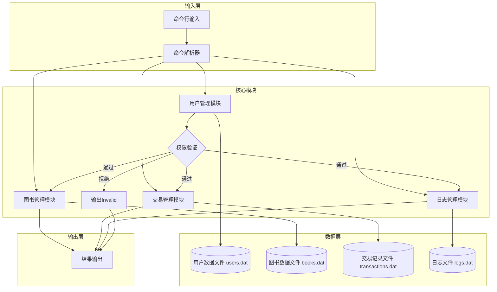

# 说明：还没写

## 输入输出即要求标准见docx/标准要求.md

## 设计见docx/总体设计.md

## 业务需求

### 基本要求

设计并实现一个书店管理系统，最终交接物为开发文档和源代码。关于程序有以下要求：

- 编程语言限制：软件主体（除 bonus 部分外）完全使用 C++ 编写；
- 程序数据需要记录到文件；
- 程序首次运行时自主执行所需的初始化操作；
  - 创建帐户名为 `root`，密码为 `sjtu`，权限为 {7} 的超级管理员帐户。
- 程序启动后，根据输入数据执行对应操作，直至读入 EOF 或根据相关指令要求终止运行。

### 交互方式

使用命令行（Windows CMD 或 Linux Terminal）进行操作，输入数据以换行符或回车符为分隔为若干指令。

指令合法字符集为标准 ASCII 字符；允许的空白符仅为空格，单个指令被空格分割为多个部分。多个连续空格效果与一个空格等价；行首行末允许出现多余空格；如无特殊说明禁止省略或另增空格。

指令中第一个部分必须为指令关键词，指令中关键词部分必须与指令格式完全匹配。

本文档中以弱化的正则语法说明指令文法。合法指令的文法相关说明如下：

- `[x]` 表示一串有特定限制的用户自定义字符串；
- `(a|b|c)` 表示此处仅能出现 `a`, `b`, `c` 中其一；
- `(x)?` 表示此处可以出现零次或一次 `x`；
- `(x)+` 表示此处可以出现一次或多次 `x`。

合法的指令如下所示：（`#` 开头的行是注释）

```
# 基础指令
quit
exit

# 帐户系统指令
su [UserID] ([Password])?
logout
register [UserID] [Password] [Username]
passwd [UserID] ([CurrentPassword])? [NewPassword]
useradd [UserID] [Password] [Privilege] [Username]
delete [UserID]

# 图书系统指令
show (-ISBN=[ISBN] | -name="[BookName]" | -author="[Author]" | -keyword="[Keyword]")?
buy [ISBN] [Quantity]
select [ISBN]
modify (-ISBN=[ISBN] | -name="[BookName]" | -author="[Author]" | -keyword="[Keyword]" | -price=[Price])+
import [Quantity] [TotalCost]

# 日志系统指令
show finance ([Count])?
log
report finance
report employee
```

在用户输入一条指令后，如果合法则执行对应操作，如果有则输出操作结果；如果指令非法或操作失败则输出 `Invalid\n`。仅有空格的指令合法且无输出内容。

除非有特殊说明，如果输入指令对应的输出内容非空，则结尾有 `\n` 字符；输出内容为空则不输出任何字符。

`quit` 和 `exit` 指令功能为正常退出系统。

### 帐户系统

书店管理系统服务于 **店主（超级管理员）**，**员工（管理员）以及顾客（用户）**。为满足其不同需求，故需帐户系统管理帐户及权限数据，并提供相应功能。

#### 权限

本文档中以 {x} 表示权限等级，数字越大则权限越高。帐户的权限等级有 {7}, {3} 和 {1}；未登录任何帐户的状态下当前帐户权限视为 {0}。低权限帐户能够访问的功能严格是高权限帐户能够访问的功能的子集，指令的权限等级表示能够执行该指令的最低当前帐户权限需求。换句话说，高权限的帐户可以执行需要低权限的指令，反之则不可。

#### 各权限可访问功能

- **店主 {7}**：使用 `root` 帐户，可以访问书店系统所有功能，包括日志和帐户管理功能；
- **员工 {3}**：可以访问修改图书数据相关功能等；
- **顾客 {1}**：可以注册帐户，查询、购买图书；
- **游客 {0}**：可以注册帐户。

本系统中有且仅有以上四种权限等级，其余权限等级非法。

#### 登录栈

系统支持嵌套登录，即允许多个帐户同时处于登录状态；允许同一帐户同时多次登录。输入的指令视为最后登录的帐户操作。退出系统视为登出所有已登录帐户。

示例：（假设所有用户均存在，所有密码均正确）

```bash
# 初始时登录栈为空
su root sjtu
select first
# 此时登录栈为 root，选择的书为 first

su root sjtu
# 此时登录栈为 root root，没有选择的书
select second

su zhang beihai
select third
# 此时登录栈为 root root zhang，选择的书为 third
# 操作的用户为 zhang，无法执行 delete 等命令

su chu yan
# 此时登录栈为 root root zhang chu，操作的用户为 chu，没有选择的书

logout
# 此时登录栈为 root root zhang，选择的书为 third

logout
# 此时登录栈为 root root，选择的书为 second

logout
# 此时登录栈为 root，选择的书为 first
```

#### 帐户信息

关于指令格式中的用户自定义字符串限定如下，其中「最大长度」含义为该字符串所占存储空间不能超过指定数目的英文字母字符所占存储空间。

- `[UserID]`, `[Password]`, `[CurrentPassword]`, `[NewPassword]`
  - 合法字符集：数字，字母，下划线；
  - 最大长度：30。
- `[Username]`
  - 合法字符集：除不可见字符以外 ASCII 字符；
  - 最大长度：30。
- `[Privilege]`
  - 合法字符集：数字；
  - 最大长度：1。

出现不符合上述限定的自定义字符串的指令视为非法，下同。

#### 帐户相关指令

本文档中指令说明格式如下：

- **指令名称**
  - {指令权限}  `[指令格式]`
  - 指令功能
  - 指令逻辑（条数不定，各逻辑间优先顺序同列举顺序）

以下为指令说明。

- **登录帐户**
  - {0} `su [UserID] ([Password])?`
  - 使登录帐户变为已登录状态，当前帐户变为该帐户。
    - 如果该帐户不存在则操作失败；
    - 如果密码错误则操作失败；
    - 如果当前帐户权限等级高于登录帐户则可以省略密码。
- **注销帐户**
  - {1} `logout`
  - 撤销最后一次成功执行的 `su` 指令效果。
    - 如无已登录帐户则操作失败。
- **注册帐户**
  - {0} `register [UserID] [Password] [Username]`
  - 注册信息如指令格式所示，权限等级为 {1} 的帐户。
    - 如果 `[UserID]` 与已注册帐户重复则操作失败。
- **修改密码**
  - {1} `passwd [UserID] ([CurrentPassword])? [NewPassword]`
  - 修改指定帐户的密码。
    - 如果该帐户不存在则操作失败；
    - 如果密码错误则操作失败；
    - 如果当前帐户权限等级为 {7} 则可以省略 `[CurrentPassword]`。
- **创建帐户**
  - {3} `useradd [UserID] [Password] [Privilege] [Username]`
  - 创建信息如指令格式所示的帐户。
    - 如果待创建帐户的权限等级大于等于当前帐户权限等级则操作失败；
    - 如果 `[UserID]` 与已注册帐户重复则操作失败。
- **删除帐户**
  - {7} `delete [UserID]`
  - 删除指定帐户。
    - 如果待删除帐户不存在则操作失败；
    - 如果待删除帐户已登录则操作失败。

### 图书系统

图书系统提供图书信息、库存信息和图书交易财务记录的相关服务及数据存储功能。

#### 图书信息

- `[ISBN]`：Internal Strange Book Number；
  - 合法字符集：除不可见字符以外 ASCII 字符；
  - 最大长度：20；
  - **特殊说明：** 本系统中任何两本图书不应有相同 `[ISBN]` 信息。
- `[BookName]`, `[Author]`：图书名字，图书作者名字；
  - 合法字符集：除不可见字符和英文双引号以外 ASCII 字符；
  - 最大长度：60。
- `[Keyword]`：图书关键词；
  - 合法字符集：除不可见字符和英文双引号以外 ASCII 字符；
  - 最大长度：60；
  - **特殊说明**：`[keyword]` 内容以 `|` 为分隔可以出现多段信息。如 `math|magic|quantum` 表示该图书具有三个无顺序的关键词 `math`, `magic` 和 `quantum`，每段信息长度至少为 1。
- `[Quantity]`：购买数量；
  - 合法字符集：数字；
  - 最大长度：10；
  - 特殊说明：数值不超过 2'147'483'647。
- `[Price]`, `[TotalCost]`：图书单价，交易总额。
  - 合法字符集：数字和 `.`；
  - 最大长度：13；
  - 特殊说明：本系统中浮点数输出精度固定为小数点后两位。

字符相关信息默认值为空，数字相关信息默认值为数值 0。

#### 图书相关指令

- **检索图书**
  
  - {1} `show (-ISBN=[ISBN] | -name="[BookName]" | -author="[Author]" | -keyword="[Keyword]")?`
  - 以 `[ISBN]` 字典升序依次输出满足要求的图书信息，每个图书信息输出格式为 `[ISBN]\t[BookName]\t[Author]\t[Keyword]\t[Price]\t[库存数量]\n`，其中 `[Keyword]` 中关键词顺序为输入时的顺序。
    - A无满足要求的图书时输出空行；
    - 无附加参数时，所有图书均满足要求；
    - 附加参数内容为空则操作失败；
    - `[Keyword]` 中出现多个关键词则操作失败。
  
- **购买图书**
  - {1} `buy [ISBN] [Quantity]`
  - 购买指定数量的指定图书（由于本系统不包括支付系统，故仅需减少库存），以浮点数输出购买图书所需的总金额。
    - 没有符合条件的图书则操作失败；
    - 购买数量为非正整数则操作失败。

- **选择图书**
  - {3} `select [ISBN]`
  - 以**当前帐户**选中指定图书（帐户登出后无需保存选中图书情况）。
    - 没有符合条件的图书则创建仅拥有 `[ISBN]` 信息的新图书；
    - 退出系统视为取消选中图书。

- **修改图书信息**
  - {3} `modify (-ISBN=[ISBN] | -name="[BookName]" | -author="[Author]" | -keyword="[Keyword]" | -price=[Price])+`
  - 以指令中的信息更新选中图书的信息。
    - 如未选中图书则操作失败；
    - 有重复附加参数为非法指令；
    - 附加参数内容为空则操作失败；
    - 不允许将 ISBN 改为原有的 ISBN，例如：

      ```
      select example
      modify -ISBN=example
      ```

      为非法操作；
    - `[keyword]` 包含重复信息段则操作失败。

- **图书进货**
  - {3} `import [Quantity] [TotalCost]`
  - 以指定交易总额购入指定数量的选中图书，增加其库存数。
    - 如未选中图书则操作失败；
    - 购入数量为非正整数则操作失败；
    - 交易总额为非正数则操作失败。

### 日志系统

日志系统负责记录书店管理系统运行过程中的各种数据，提供各类日志信息查询服务

#### 日志信息

- `[Count]`：交易笔数
  - 合法字符集：数字；
  - 最大长度：10；
  - 特殊说明：数值不超过 2'147'483'647。

#### 日志相关指令

- **财务记录查询**
  - {7} `show finance ([Count])?`
  - 输出最后完成的指定笔数交易总额，格式为 `+ [收入] - [支出]\n`，例如 `+ 1.23 - 45678.90`。
    - 无 `Count` 参数时，输出所有交易之总额；
      - 不存在交易时认为收入支出均为 0.00。
    - `Count` 为 0 时输出空行；
    - `Count` 大于历史交易总笔数时操作失败。

- **生成财务记录报告指令**
      - {7} `report finance` 🎗️
          - 生成一张赏心悦目的财务报表，格式自定

  - **生成全体员工工作情况报告指令**
    - {7} `report employee` 🎗️
    - 生成一张赏心悦目的员工工作情况表，记录其操作，格式自定
- **生成日志**
  - {7} `log`🎗️
  - 返回日志记录，包括系统操作类的谁干了什么，以及财务上每一笔交易情况，格式自定。

- **注意**：带有 🎗️ 标记的指令不会出现在测试数据中，但需要实现并手动向助教展示。

### 性能需求

考虑到应用场景下帐户和图书数量较大，故**禁止将主体数据存储于内存**，应实时读写文件数据。运行过程中程序创建的文件数量不得超过 20 个。

禁止类似 filesystem as database 的实现方式。*（如果你不知道这是什么意思，那么也不用担心自己会触犯该条要求。）*

## 书店管理系统总体设计文档

### 项目名称

书店管理系统

### 文档作者

Bonan Jin

### 程序功能概述

一个基于命令行交互的书店管理系统，有顾客、销售人员和店长三类角色，通过权限分级实现差异化功能访问。所有主体数据实时存储于外存文件，支持嵌套登录（多账户同时登录，指令默认由最后登录账户执行）。核心功能包括：

- 用户管理：注册、登录/登出、权限控制、账户创建与删除、密码修改
- 图书管理：查询（多条件筛选）、购买、录入、信息修改、进货
- 交易管理：销售记录、采购记录、盈利统计与财务报表生成
- 日志管理：操作日志记录、财务日志查询、员工工作报告生成

系统首次运行时自动完成初始化，创建店主账户（root，密码，权限{7}），通过命令行指令接收操作，直至读入EOF或`quit`/`exit`指令终止。

### 主体逻辑说明

1. **初始化阶段**：
   - 程序启动时检查核心数据文件（用户、图书、交易、日志）是否存在
   - 首次运行时创建初始文件及root账户，非首次运行则加载现有文件结构
   - 初始化登录栈（支持嵌套登录）及当前选中图书状态

2. **命令处理阶段**：
   - 读取用户输入指令，去除冗余空格后进行解析
   - 验证指令格式是否合法（关键词、参数个数及格式）
   - 根据当前登录账户权限（未登录为{0}）判断操作权限
   - 调用对应模块处理逻辑（如用户操作调用UserManager）
   - 读写文件完成数据更新
   - 输出处理结果（成功信息/列表）或`Invalid\n`（失败时）

3. **终止阶段**：
   - 接收`quit`/`exit`指令或EOF时，确保所有未完成写操作提交至文件
   - 释放资源并正常退出程序

### 代码文件结构

```
main.cpp                  // 程序入口，负责初始化、命令循环与资源释放
├─ include/
│  ├─ User.h              // User类及UserManager类声明（用户管理）（注册、登录、权限控制等）
│  ├─ Book.h              // Book类及BookManager类声明（图书管理）（查询、修改、库存操作等）
│  ├─ Transaction.h       // Transaction类（交易管理）（销售、采购、盈利计算等）
│  ├─ Log.h               // Log类及LogManager类声明（日志管理）(日志记录与查询实现)
│  ├─ Parser.h            // Parser类声明（命令解析）
│  ├─ Storage.h           // 数据存储接口声明
│  └─ Utils.h             // 工具函数声明（时间、文件IO、权限）
└─ src/
   ├─ User.cpp
   ├─ Book.cpp
   ├─ Transaction.cpp
   ├─ Log.cpp
   ├─ Parser.cpp
   ├─ Storage.cpp 
   └─ Utils.cpp
```

**main函数与类的关系**：

- main函数初始化各管理器实例（UserManager、BookManager等）及命令解析器
- 通过CommandParser持续读取并解析指令，根据指令类型分发至对应管理器
- 各管理器独立负责本模块的业务逻辑，通过utils模块实现文件IO操作
- 登录状态通过UserManager的登录栈维护，当前操作权限由栈顶用户决定

### 功能设计

#### 模块功能概述

1. **用户管理模块**
   - 核心功能：账户注册（{0}及以上）、登录/登出（{0}及以上）、密码修改（权限验证）、账户创建（{3}及以上可创建{1}，{7}可创建{3}）、账户删除（{7}专属）
   - 权限控制：{0}⊂{1}⊂{3}⊂{7}的子集关系

2. **图书管理模块**
   - 核心功能：图书查询（{1}及以上，多条件筛选）、购买（{1}及以上，扣减库存）、选中图书（{3}及以上，支持创建新图书骨架）、修改信息（{3}及以上，基于选中状态）、进货（{3}及以上，增加库存）
   - 数据约束：ISBN唯一，关键词以`|`分隔且无重复，数值型参数符合范围限制

3. **交易管理模块**
   - 核心功能：销售记录生成（购买时自动创建）、采购记录生成（进货时自动创建）、财务查询（{7}专属，支持指定条数或全量）、盈利计算（收入-支出）
   - 关联关系：交易记录与操作人、图书ISBN关联，支持时间范围筛选

4. **日志管理模块**
   - 核心功能：操作日志记录（所有操作自动生成）、财务日志查询（{7}专属）、员工工作报告（{7}专属，按用户筛选）、系统日志导出（{7}专属）
   - 日志内容：包含时间戳、操作人、操作类型及详情，支持按时间范围

#### 功能结构图



### 数据库设计

#### 存储数据项

1. **用户数据（users.dat）**
   - 存储内容：UserID（用户名）、Password（密码）、Privilege（权限等级）、Username（显示名）
   - 格式：`UserID\tPassword\tPrivilege\tUsername\n`
   - 约束：UserID唯一，Privilege只能为1/3/7

2. **图书数据（books.dat）**
   - 存储内容：ISBN、BookName、Author、Keyword、Price、Quantity（库存）
   - 格式：`ISBN\tBookName\tAuthor\tKeyword\tPrice\tQuantity\n`
   - 约束：ISBN唯一，Keyword无重复段，Price保留2位小数，Quantity≥0

3. **交易记录（transactions.dat）**
   - 存储内容：Time（时间戳）、Type（交易类型：buy/import）、ISBN、Quantity、Amount（金额）、Operator（操作人ID）
   - 格式：`Time\tType\tISBN\tQuantity\tAmount\tOperator\n`
   - 约束：Amount保留2位小数（buy为正，import为负），Quantity>0

4. **日志数据（logs.dat）**
   - 存储内容：Time（时间戳）、Operator（操作人ID）、Operation（操作类型）、Details（详情）
   - 格式：`Time\tOperator\tOperation\tDetails\n`
   - 示例：`2025-12-01 10:00:00\troot\tcreate_user\tuser1 123 1 User1`

#### 存储约束

- 总文件数≤20
- 所有数据实时写入外存，操作过程中不缓存全量数据
- 采用制表符（\t）分隔字段，换行符（\n）分隔记录，支持逐行读写
- 数值型数据（价格、数量等）严格校验格式

### 类、结构体设计

1. **User类**

   ```cpp
   class User {
   private:
       std::string user_id;       // 登录ID（唯一）
       std::string password;      // 密码
       int privilege;             // 权限等级（1/3/7）
       std::string username;      // 用户名
   public:
       User() = default;
       User(const std::string& id, const std::string& pwd, int priv, const std::string& name);
       std::string get_user_id() const;
       std::string get_username() const;
       int get_privilege() const;
       bool verify_password(const std::string& input) const;  // 密码验证
       bool has_privilege(int required) const;                // 权限检查（≥required）
       void set_password(const std::string& new_pwd);         // 修改密码
   };
   ```

2. **Book类**

   ```cpp
   class Book {
   private:
       std::string isbn;          // 唯一标识
       std::string name;          // 书名
       std::string author;        // 作者
       std::string keyword;       // 关键词（|分隔，无重复）
       double price;              // 单价（保留2位小数）
       int quantity;              // 库存数量（≥0）
   public:
       Book() = default;
       Book(const std::string& isbn);  // 仅初始化ISBN（用于select创建）
       Book(const std::string& isbn, const std::string& name, const std::string& author, 
            const std::string& keyword, double price, int quantity);
       // get
       std::string get_isbn() const;
       std::string get_name() const;
       int get_quantity() const;
       double get_price() const;
       // 库存操作
       bool increase_quantity(int num);  // 进货
       bool decrease_quantity(int num);  // 购买
       // 修改属性（返回是否成功）
       bool set_name(const std::string& new_name);
       bool set_author(const std::string& new_author);
       bool set_keyword(const std::string& new_keyword);
       bool set_price(double new_price);
       bool set_isbn(const std::string& new_isbn);
       // 匹配查询条件
       bool match(const std::string& type, const std::string& value) const;
   };
   ```

3. **Transaction结构体**

   ```cpp
   struct Transaction {
       std::string time;          // 时间戳（YYYY-MM-DD HH:MM:SS）
       std::string type;          // "buy"或"import"
       std::string isbn;
       int quantity;              // 交易数量（>0）
       double amount;             // 金额（buy为正，import为负）
       std::string operator_id;   // 操作人ID

       Transaction() = default;
       Transaction(const std::string& t, const std::string& typ, const std::string& isbn,
                   int qty, double amt, const std::string& op);
       std::string to_string() const;  // 转换为存储格式字符串
   };
   ```

4. **Log结构体**

   ```cpp
   struct Log {
       std::string time;          // 时间戳
       std::string operator_id;   // 操作人ID（未登录为"guest"）
       std::string operation;     // 操作类型（如"login"、"buy"等）
       std::string details;       // 操作详情

       Log() = default;
       Log(const std::string& t, const std::string& op_id, const std::string& op, const std::string& det);
       std::string to_string() const;  // 转换为存储格式字符串
   };
   ```

5. **管理器类（示例：UserManager）**

   ```cpp
   class UserManager {
   private:
       std::string file_path;                 // 数据文件路径
       std::stack<User> login_stack;          // 嵌套登录栈
       bool load_user(const std::string& user_id, User& user);  // 从文件加载单个用户
       bool save_user(const User& user);      // 保存用户到文件
       bool delete_user_file(const std::string& user_id);  // 从文件删除用户
   public:
       UserManager(const std::string& path);
       bool init_root();                      // 初始化root用户（首次运行）
       bool register_user(const std::string& user_id, const std::string& pwd, const std::string& name);  // {0}可调用
       bool login(const std::string& user_id, const std::string& pwd);
       bool logout();
       bool create_user(const std::string& user_id, const std::string& pwd, 
           int priv, const std::string& name, int current_priv);  // 权限检查
       bool delete_user(const std::string& user_id, int current_priv);  // 权限检查
       bool change_password(const std::string& user_id, const std::string& old_pwd, const std::string& new_pwd, int current_priv);
       int get_current_privilege() const;     // 获取当前登录用户权限
       std::string get_current_user_id() const;  // 获取当前登录用户ID
   };
   ```

### 其他补充说明

1. **文件IO优化**：采用逐行查找与写入，避免全量加载数据，通过索引标记常用数据位置提升效率。
2. **错误处理**：所有非法指令或操作失败（如权限不足、参数无效）均输出`Invalid\n`，详细错误原因记录至日志文件。
3. **版本控制**：遵循Git规范。
4. **代码风格**：采用统一代码风格（缩进4空格、命名规范：类名PascalCase，函数/变量名camelCase），添加必要注释。
5. **性能**：针对高频操作（如图书查询）通过关键词索引文件加速多条件筛选。
