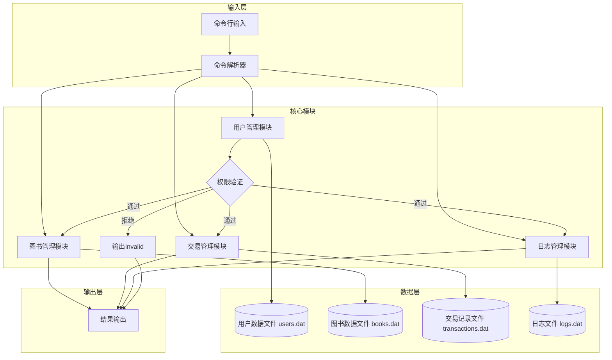

# 书店管理系统总体设计文档

## 项目名称

书店管理系统

## 文档作者

Bonan Jin

## 程序功能概述

一个基于命令行交互的书店管理系统，有顾客、销售人员和店长三类角色，通过权限分级实现差异化功能访问。所有主体数据实时存储于外存文件，支持嵌套登录（多账户同时登录，指令默认由最后登录账户执行）。核心功能包括：

- 用户管理：注册、登录/登出、权限控制、账户创建与删除、密码修改
- 图书管理：查询（多条件筛选）、购买、录入、信息修改、进货
- 交易管理：销售记录、采购记录、盈利统计与财务报表生成
- 日志管理：操作日志记录、财务日志查询、员工工作报告生成

系统首次运行时自动完成初始化，创建店主账户（root，密码，权限{7}），通过命令行指令接收操作，直至读入EOF或`quit`/`exit`指令终止。

## 主体逻辑说明

1. **初始化阶段**：
   - 程序启动时检查核心数据文件（用户、图书、交易、日志）是否存在
   - 首次运行时创建初始文件及root账户，非首次运行则加载现有文件结构
   - 初始化登录栈（支持嵌套登录）及当前选中图书状态

2. **命令处理阶段**：
   - 读取用户输入指令，去除冗余空格后进行解析
   - 验证指令格式是否合法（关键词、参数个数及格式）
   - 根据当前登录账户权限（未登录为{0}）判断操作权限
   - 调用对应模块处理逻辑（如用户操作调用UserManager）
   - 读写文件完成数据更新
   - 输出处理结果（成功信息/列表）或`Invalid\n`（失败时）

3. **终止阶段**：
   - 接收`quit`/`exit`指令或EOF时，确保所有未完成写操作提交至文件
   - 释放资源并正常退出程序

## 代码文件结构

```
main.cpp                  // 程序入口，负责初始化、命令循环与资源释放
├─ include/
│  ├─ User.hpp              // User类及UserManager类声明（用户管理）（注册、登录、权限控制等）
│  ├─ Book.hpp              // Book类及BookManager类声明（图书管理）（查询、修改、库存操作等）
│  ├─ Transaction.h       // Transaction类（交易管理）（销售、采购、盈利计算等）
│  ├─ Log.hpp               // Log类及LogManager类声明（日志管理）(日志记录与查询实现)
│  ├─ Parser.hpp            // Parser类声明（命令解析）
│  ├─ Storage.hpp           // 数据存储接口声明
│  └─ Utils.hpp             // 工具函数声明
└─ src/
   ├─ User.cpp
   ├─ Book.cpp
   ├─ Transaction.cpp
   ├─ Log.cpp
   ├─ Parser.cpp
   ├─ Storage.cpp 
   └─ Utils.cpp
```

**main函数与类的关系**：

- main函数初始化各管理器实例（UserManager、BookManager等）及命令解析器
- 通过CommandParser持续读取并解析指令，根据指令类型分发至对应管理器
- 各管理器独立负责本模块的业务逻辑，通过utils模块实现文件IO操作
- 登录状态通过UserManager的登录栈维护，当前操作权限由栈顶用户决定

## 功能设计

### 模块功能概述

1. **用户管理模块**
   - 核心功能：账户注册（{0}及以上）、登录/登出（{0}及以上）、密码修改（权限验证）、账户创建（{3}及以上可创建{1}，{7}可创建{3}）、账户删除（{7}专属）
   - 权限控制：{0}⊂{1}⊂{3}⊂{7}的子集关系

2. **图书管理模块**
   - 核心功能：图书查询（{1}及以上，多条件筛选）、购买（{1}及以上，扣减库存）、选中图书（{3}及以上，支持创建新图书骨架）、修改信息（{3}及以上，基于选中状态）、进货（{3}及以上，增加库存）
   - 数据约束：ISBN唯一，关键词以`|`分隔且无重复，数值型参数符合范围限制

3. **交易管理模块**
   - 核心功能：销售记录生成（购买时自动创建）、采购记录生成（进货时自动创建）、财务查询（{7}专属，支持指定条数或全量）、盈利计算（收入-支出）
   - 关联关系：交易记录与操作人、图书ISBN关联，支持时间范围筛选

4. **日志管理模块**
   - 核心功能：操作日志记录（所有操作自动生成）、财务日志查询（{7}专属）、员工工作报告（{7}专属，按用户筛选）、系统日志导出（{7}专属）
   - 日志内容：包含时间戳、操作人、操作类型及详情，支持按时间范围

### 功能结构图



## 数据库设计

### 存储数据项

1. **用户数据（users.dat）**
   - 存储内容：UserID（用户名）、Password（密码）、Privilege（权限等级）、Username（显示名）
   - 格式：`UserID\tPassword\tPrivilege\tUsername\n`
   - 约束：UserID唯一，Privilege只能为1/3/7

2. **图书数据（books.dat）**
   - 存储内容：ISBN、BookName、Author、Keyword、Price、Quantity（库存）
   - 格式：`ISBN\tBookName\tAuthor\tKeyword\tPrice\tQuantity\n`
   - 约束：ISBN唯一，Keyword无重复段，Price保留2位小数，Quantity≥0

3. **交易记录（transactions.dat）**
   - 存储内容：Time（时间戳）、Type（交易类型：buy/import）、ISBN、Quantity、Amount（金额）、Operator（操作人ID）
   - 格式：`Time\tType\tISBN\tQuantity\tAmount\tOperator\n`
   - 约束：Amount保留2位小数（buy为正，import为负），Quantity>0

4. **日志数据（logs.dat）**
   - 存储内容：Time（时间戳）、Operator（操作人ID）、Operation（操作类型）、Details（详情）
   - 格式：`Time\tOperator\tOperation\tDetails\n`
   - 示例：`2025-12-01 10:00:00\troot\tcreate_user\tuser1 123 1 User1`

### 存储约束

- 总文件数≤20
- 所有数据实时写入外存，操作过程中不缓存全量数据
- 采用制表符（\t）分隔字段，换行符（\n）分隔记录，支持逐行读写
- 数值型数据（价格、数量等）严格校验格式

## 类、结构体设计

1. **User类**

   ```cpp
   class User {
   private:
       std::string user_id;       // 登录ID（唯一）
       std::string password;      // 密码
       int privilege;             // 权限等级（1/3/7）
       std::string username;      // 用户名
   public:
       User() = default;
       User(const std::string& id, const std::string& pwd, int priv, const std::string& name);
       std::string get_user_id() const;
       std::string get_username() const;
       int get_privilege() const;
       bool verify_password(const std::string& input) const;  // 密码验证
       bool has_privilege(int required) const;                // 权限检查（≥required）
       void set_password(const std::string& new_pwd);         // 修改密码
   };
   ```

2. **Book类**

   ```cpp
   class Book {
   private:
       std::string isbn;          // 唯一标识
       std::string name;          // 书名
       std::string author;        // 作者
       std::string keyword;       // 关键词（|分隔，无重复）
       double price;              // 单价（保留2位小数）
       int quantity;              // 库存数量（≥0）
   public:
       Book() = default;
       Book(const std::string& isbn);  // 仅初始化ISBN（用于select创建）
       Book(const std::string& isbn, const std::string& name, const std::string& author, 
            const std::string& keyword, double price, int quantity);
       // get
       std::string get_isbn() const;
       std::string get_name() const;
       int get_quantity() const;
       double get_price() const;
       // 库存操作
       bool increase_quantity(int num);  // 进货
       bool decrease_quantity(int num);  // 购买
       // 修改属性（返回是否成功）
       bool set_name(const std::string& new_name);
       bool set_author(const std::string& new_author);
       bool set_keyword(const std::string& new_keyword);
       bool set_price(double new_price);
       bool set_isbn(const std::string& new_isbn);
       // 匹配查询条件
       bool match(const std::string& type, const std::string& value) const;
   };
   ```

3. **Transaction结构体**

   ```cpp
   struct Transaction {
       std::string time;          // 时间戳（YYYY-MM-DD HH:MM:SS）
       std::string type;          // "buy"或"import"
       std::string isbn;
       int quantity;              // 交易数量（>0）
       double amount;             // 金额（buy为正，import为负）
       std::string operator_id;   // 操作人ID

       Transaction() = default;
       Transaction(const std::string& t, const std::string& typ, const std::string& isbn,
                   int qty, double amt, const std::string& op);
       std::string to_string() const;  // 转换为存储格式字符串
   };
   ```

4. **Log结构体**

   ```cpp
   struct Log {
       std::string time;          // 时间戳
       std::string operator_id;   // 操作人ID（未登录为"guest"）
       std::string operation;     // 操作类型（如"login"、"buy"等）
       std::string details;       // 操作详情

       Log() = default;
       Log(const std::string& t, const std::string& op_id, const std::string& op, const std::string& det);
       std::string to_string() const;  // 转换为存储格式字符串
   };
   ```

5. **管理器类（示例：UserManager）**

   ```cpp
   class UserManager {
   private:
       std::string file_path;                 // 数据文件路径
       std::stack<User> login_stack;          // 嵌套登录栈
       bool load_user(const std::string& user_id, User& user);  // 从文件加载单个用户
       bool save_user(const User& user);      // 保存用户到文件
       bool delete_user_file(const std::string& user_id);  // 从文件删除用户
   public:
       UserManager(const std::string& path);
       bool init_root();                      // 初始化root用户（首次运行）
       bool register_user(const std::string& user_id, const std::string& pwd, const std::string& name);  // {0}可调用
       bool login(const std::string& user_id, const std::string& pwd);
       bool logout();
       bool create_user(const std::string& user_id, const std::string& pwd, 
           int priv, const std::string& name, int current_priv);  // 权限检查
       bool delete_user(const std::string& user_id, int current_priv);  // 权限检查
       bool change_password(const std::string& user_id, const std::string& old_pwd, const std::string& new_pwd, int current_priv);
       int get_current_privilege() const;     // 获取当前登录用户权限
       std::string get_current_user_id() const;  // 获取当前登录用户ID
   };
   ```

## 其他补充说明

1. **文件IO优化**：采用逐行查找与写入，避免全量加载数据，通过索引标记常用数据位置提升效率。
2. **错误处理**：所有非法指令或操作失败（如权限不足、参数无效）均输出`Invalid\n`，详细错误原因记录至日志文件。
3. **版本控制**：遵循Git规范。
4. **代码风格**：采用统一代码风格（缩进4空格、命名规范：类名PascalCase，函数/变量名camelCase），添加必要注释。
5. **性能**：针对高频操作（如图书查询）通过关键词索引文件加速多条件筛选。
