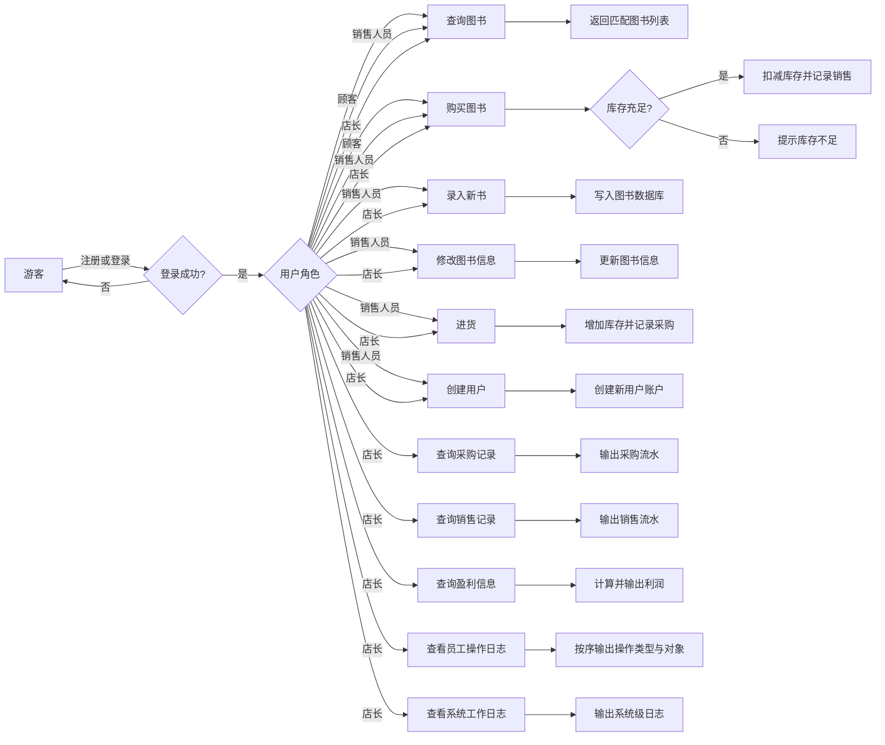
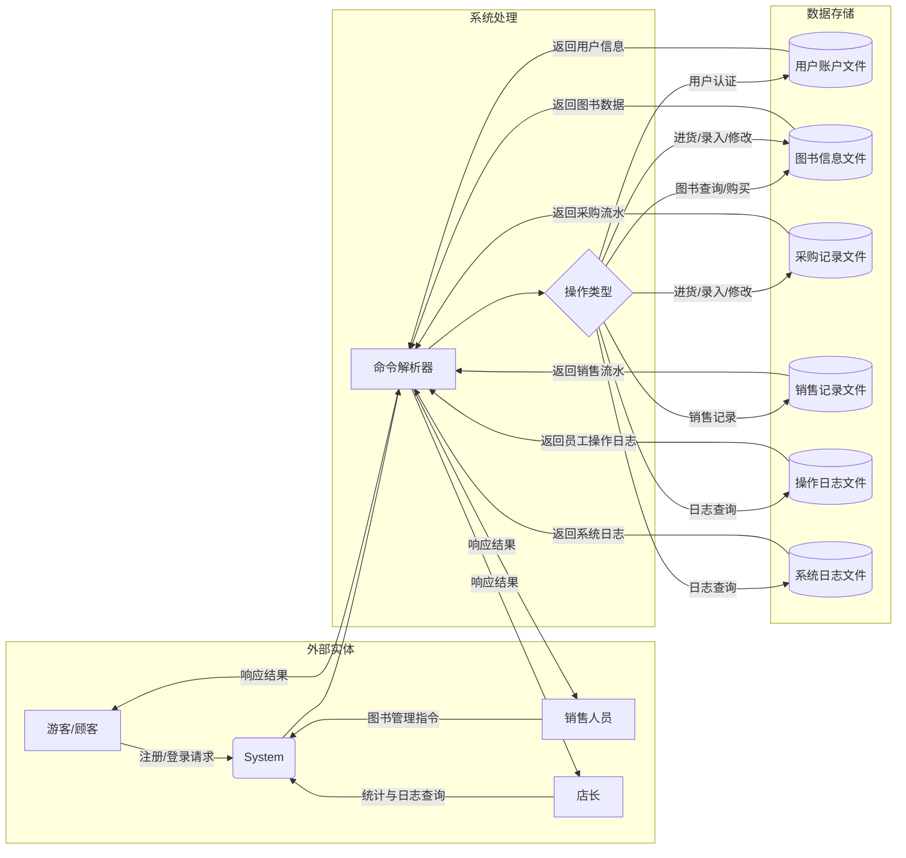

# 书店管理系统需求分析文档

## 1. 项目概述

### 1.1 项目名称

书店管理系统

### 1.2 文档作者

Bonan Jin

### 1.3 项目目标

设计并实现一个面向顾客、销售人员和店长的书店管理系统，支持图书查询、购买、进货、信息管理等功能，通过命令行交互，数据存储于外存，满足不同角色的权限需求及性能要求。

## 2. 业务流图

### 2.1 整体业务流程

```
游客 → 注册/登录 → 顾客/销售人员/店长
    ├─ 顾客 → 查询图书 → 购买图书
    ├─ 销售人员 → 顾客操作 + 进货/图书录入/信息修改/用户创建（顾客/销售人员）
    └─ 店长 → 销售人员操作 + 采购/销售/盈利查询 + 员工报告/系统日志查看
```



### 2.2 核心业务子流程

- **用户管理流程**：游客注册→身份验证→权限分配→登录状态管理
- **图书管理流程**：图书信息录入→库存更新（进货/销售）→信息查询→信息修改
- **交易管理流程**：购买/进货操作→库存变更→交易记录存储→报表生成（店长专用）
- **系统初始化流程**：首次运行→创建店主账户（最高权限）→系统就绪

## 3. 数据流

### 3.1 数据流图



### 3.2 关键子流程数据流

- **图书查询流程**：用户查询条件→系统→图书信息库→查询结果→用户
- **购买流程**：用户购买请求（ISBN+数量）→系统→库存验证→库存更新→交易记录存储→交易结果反馈
- **进货流程**：销售人员进货请求（ISBN+数量+进货价）→系统→图书信息验证→库存更新→交易记录存储→进货结果反馈
- **权限验证流程**：用户操作请求→系统→用户信息库→权限校验结果→操作允许/拒绝

## 4. 数据词典

### 4.1 用户信息

- `user_id`：用户唯一标识（字符串，20位）
- `username`：用户名（字符串，1-20位）
- `password`：密码（字符串，6-20位）
- `role`：用户角色（游客/顾客/销售人员/店长）
- `register_time`：注册时间（格式：YYYY-MM-DD HH:MM:SS）

### 4.2 图书信息

- `isbn`：图书唯一标识（字符串，20位）
- `title`：书名（字符串，1-60位）
- `author`：作者（字符串，1-60位）
- `keywords`：关键字（字符串，总长度≤60位，多关键字用逗号分隔）
- `stock`：库存量（整数，≥0）
- `price`：售价（非负实数，保留2位小数）
- `purchase_price`：最近进货价（非负实数，保留2位小数，用于进货记录参考）
- `update_time`：最后更新时间（时间戳）

### 4.3 交易记录

- `record_id`：记录唯一标识（整数，自增）
- `isbn`：关联图书ISBN（字符串，20位）
- `quantity`：数量（整数，正数为销售，负数为进货）
- `amount`：交易金额（实数，正数为收入，负数为支出）
- `operator_id`：操作人ID（字符串，20位）
- `time`：交易时间（时间戳）
- `type`：交易类型（枚举：销售/进货）

### 4.4 系统日志

- `log_id`：日志唯一标识（整数，自增）
- `operator_id`：操作人ID（字符串，20位）
- `operation_type`：操作类型（字符串：注册/登录/进货/销售/图书录入/信息修改等）
- `operation_details`：操作详情（字符串，描述操作内容）
- `time`：操作时间（时间戳）

## 5. 功能说明

### 5.1 用户管理模块

- **功能1：用户注册**
  - 输入：用户名、密码、角色（游客只能注册顾客角色）
  - 输出：注册成功/失败提示（失败原因：用户名已存在、格式错误等）
  - 处理：验证信息合法性→存储用户信息→生成注册日志

- **功能2：用户登录**
  - 输入：用户名、密码
  - 输出：登录成功/失败提示
  - 处理：验证用户信息→更新登录状态栈（支持嵌套登录，记录登录顺序）→生成登录日志

- **功能3：用户退出登录**
  - 输入：无（执行logout命令）
  - 输出：退出成功提示（若嵌套登录则返回上一账户）
  - 处理：更新登录状态栈→生成退出日志

- **功能4：用户创建（销售人员）**
  - 输入：新用户名、密码、角色（只能创建顾客/销售人员）
  - 输出：创建成功/失败提示
  - 处理：验证操作人员权限→执行注册流程→生成操作日志

- **功能5：系统初始化（首次运行）**
  - 输入：无（系统自动触发）
  - 输出：店主账户创建成功提示
  - 处理：生成默认店主账户（最高权限）→初始化数据存储文件→生成系统日志

### 5.2 图书管理模块

- **功能1：图书查询**
  - 输入：查询条件（ISBN/书名/作者/关键字的任意组合）
  - 输出：符合条件的图书列表（含完整信息）
  - 处理：解析查询条件→检索图书信息库→返回格式化结果

- **功能2：图书录入（销售人员）**
  - 输入：图书完整信息（ISBN、书名、作者、关键字、初始库存、售价）
  - 输出：录入成功/失败提示（失败原因：ISBN已存在、格式错误等）
  - 处理：验证信息合法性及操作权限→存储图书信息→生成操作日志

- **功能3：图书信息修改（销售人员）**
  - 输入：ISBN、需修改的字段及内容（支持书名/作者/关键字/售价）
  - 输出：修改成功/失败提示（失败原因：ISBN不存在、无权限等）
  - 处理：验证权限及ISBN存在性→更新图书信息→生成操作日志

- **功能4：进货操作（销售人员）**
  - 输入：ISBN、数量、进货价格
  - 输出：进货成功/失败提示（失败原因：ISBN不存在、数量为负等）
  - 处理：验证权限→更新库存→记录进货交易→生成操作日志

### 5.3 交易管理模块

- **功能1：购买图书（顾客/销售人员/店长）**
  - 输入：ISBN、购买数量
  - 输出：购买成功/失败提示（失败原因：库存不足、ISBN不存在等）
  - 处理：验证库存→扣减库存→记录销售交易→生成操作日志

- **功能2：采购信息查询（店长）**
  - 输入：时间范围（开始时间、结束时间）
  - 输出：该时段内的进货记录列表（按时间顺序）
  - 处理：验证权限→检索交易记录库→筛选进货记录→格式化输出

- **功能3：销售信息查询（店长）**
  - 输入：时间范围
  - 输出：该时段内的销售记录列表（按时间顺序）
  - 处理：验证权限→检索交易记录库→筛选销售记录→格式化输出

- **功能4：盈利信息查询（店长）**
  - 输入：时间范围
  - 输出：该时段内的总收入、总支出、利润（利润=总收入-总支出）
  - 处理：验证权限→计算交易记录中收支总和→计算利润→格式化输出

### 5.4 日志管理模块（店长）

- **功能1：员工工作报告查询**
  - 输入：员工ID、时间范围（可选）
  - 输出：该员工的操作记录列表（按时间顺序）
  - 处理：验证权限→检索系统日志→筛选指定员工记录→格式化输出

- **功能2：系统工作日志查询**
  - 输入：时间范围（可选）
  - 输出：系统所有操作记录列表（按时间顺序）
  - 处理：验证权限→检索系统日志→筛选指定时段记录→格式化输出

## 6. 用户交互设计

### 6.1 通用命令

- 登录：`login [username] [password]`
  - 输出：`Login successful.` 或 `Login failed: [reason]`
- 注册：`register [username] [password]`
  - 输出：`Register successful.` 或 `Register failed: [reason]`
- 退出当前登录：`logout`
  - 输出：`Logout successful.`（若嵌套登录则返回上一账户）
- 退出系统：`exit`
  - 输出：（无输出，直接退出程序）

### 6.2 顾客命令

- 查询图书：`query [condition_type] [condition]`（支持多条件组合，用空格分隔）
  - 条件类型：`isbn`/`title`/`author`/`keyword`
  - 输出：符合条件的图书列表（每行一条，格式：`ISBN: [isbn], Title: [title], Author: [author], Keywords: [keywords], Stock: [stock], Price: [price]`）
- 购买图书：`buy [isbn] [quantity]`
  - 输出：`Buy successful. Total cost: [amount]` 或 `Buy failed: [reason]`

### 6.3 销售人员命令

- 录入图书：`add_book [isbn] [title] [author] [keywords] [stock] [price]`
  - 输出：`Add book successful.` 或 `Add book failed: [reason]`
- 修改图书：`modify_book [isbn] [field] [new_value]`
  - 字段：`title`/`author`/`keywords`/`price`
  - 输出：`Modify book successful.` 或 `Modify book failed: [reason]`
- 进货操作：`restock [isbn] [quantity] [purchase_price]`
  - 输出：`Restock successful. Total cost: [amount]` 或 `Restock failed: [reason]`
- 创建用户：`create_user [username] [password] [role]`
  - 角色：`customer`/`salesman`
  - 输出：`Create user successful.` 或 `Create user failed: [reason]`

### 6.4 店长命令

- 查询采购记录：`query_purchase [start_time] [end_time]`
  - 输出：采购记录列表（每行一条，格式：`Time: [time], ISBN: [isbn], Quantity: [quantity], Price: [purchase_price]`）
- 查询销售记录：`query_sales [start_time] [end_time]`
  - 输出：销售记录列表（每行一条，格式：`Time: [time], ISBN: [isbn], Quantity: [quantity], Price: [price]`）
- 查询盈利信息：`query_profit [start_time] [end_time]`
  - 输出：`Income: [income], Expense: [expense], Profit: [profit]`
- 查询员工报告：`query_employee [user_id] [start_time] [end_time]`
  - 输出：员工操作记录列表（每行一条，格式：`Time: [time], Operation: [type], Details: [details]`）
- 查询系统日志：`query_log [start_time] [end_time]`
  - 输出：系统日志列表（格式同上）

> 注：时间格式统一为`YYYY-MM-DD HH:MM:SS`

